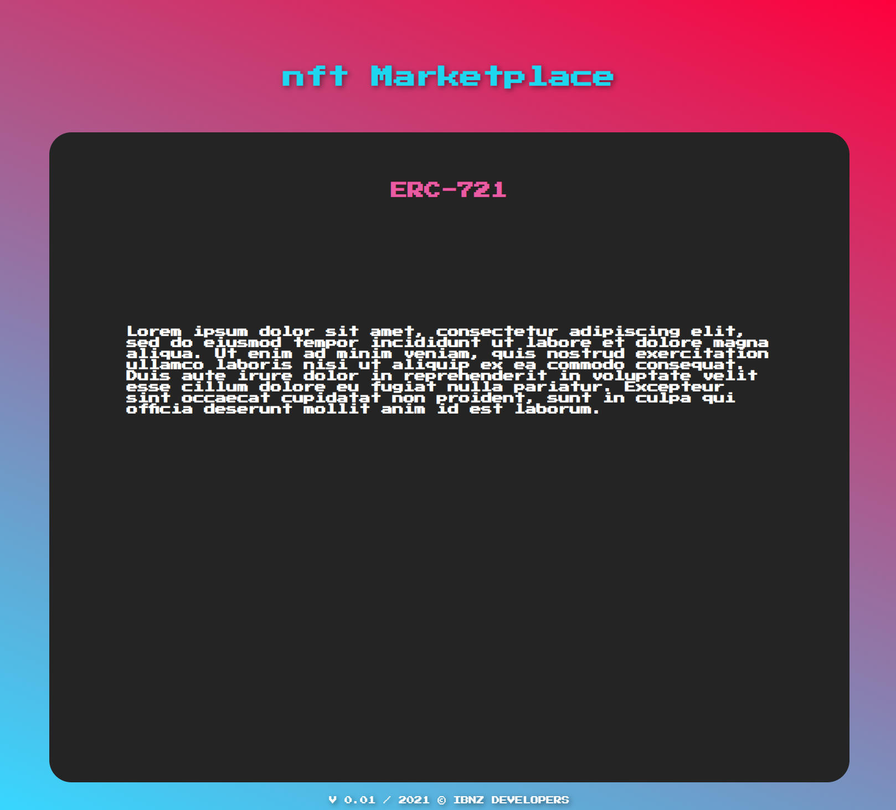

This is a React, JS, Solidity application, for issue, mint, list and sell NFT (ERC-721 & ERC1155) Tokens 

# Idea and functionalities 

- Create an NFT marketplace contract that supports ERC721 and ERC1155

- Sellers can list their NFTs on this platform

- Buyers can preview, and purchase NFTs listed on the platform

## Community coders, please commit

Feel free to add extra functions or improvements, This helps me to familiarise myself with source control and open source project managing.

-----

## Running instructions

- Copy project to your directory ( git clone https://github.com/ibnzUK/NFT-Marketplace )
- navigate to _NFT-Marketplace_ project directory
- make sure you have node.js installed on your machine
- install project packages (npm install)
- start a project (npm run start)

## Changes in V 0.01

- Added Skeleton

## Changes in V 0.02

- Connected to Metamask
- Added ERC721 Contract
- Started NFTMinter Contract
- Added truffle-flattener and flattened openZeppelin contracts
- Contracts and Solc compiler updated to version: "^0.8" 
- Added Tests and Migration 

# Tests

  Contract: NFTMinter
    Checking if conract is deployed to network
      ✓ contract deployed sucessfully
      ✓ contract has matching name (134ms)
      ✓ token has symbol (196ms)
    Minting of new token
      ✓ creates new token (476ms)
      ✓ mints tokens from 0x0 address (549ms)
      ✓ send tokens to minter (559ms)
      ✓ token total supply is updated (1481ms)

  7 passing (3s)

